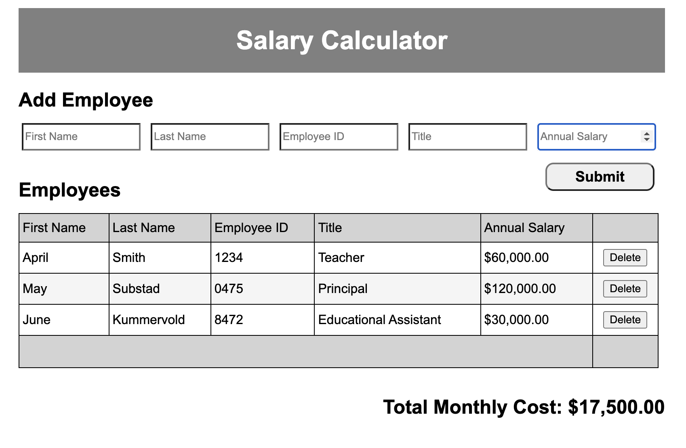

# Project Name

Monthly Cost Calculator

## Description

For this project, I created an app that records employee salaries and sums those salaries to calculate and report monthly costs. 

To solve this problem, I began by adding some elements (such as a header, form, table, submit and delete buttons, and div class) to my HTML file so that I could use JQuery to select them later. 

My next step was to add click listeners for the submit and delete buttons in the readyNow function within the JS file.

I created a function onDelete to give instructions to remove an employee from the DOM when the delete button is clicked. To do this, I used the keyword this to refer to the button that was clicked, and removed its parents which removes one entire row of information at a time from the DOM. To remove the corresponding employee object from the array, I first used the this keyword with the text() method to get the information about the employee that was deleted into a string. I then used the split() method and the shift() method to divide the string into individual words, and pushed those into a new array called deleteEmployeeArray. After that, this function loops through the employee array of objects and compares the employee ids in that array to the employee id of the employee who was removed from the DOM. Once the match is found, I used the splice method to delete the object from that array at that specific index. The getMonthlyCost function is called and saved in a variable called totalMonthlyCost. Last, the variable totalMonthlyCost is passed into the render function array, which is called at the end of this function.

When the submit button is clicked, a function called getInfo runs. 

The getInfo function gets the input from the form and stores it in an array of objects. It also clears the input field once the submit button is clicked. At the end of the getInfo function, a function called getMonthlyCost is called and saved into the variable totalMonthlyCost. Finally, the variable totalMonthlyCost is passed into the render function, which is called at the end of the getInfo function.

The getMonthlyCost function declares the variables totalAnnualCost and totalMonthly cost. After, it loops through the array of objects and calculates the totalAnnual cost by adding the totalAnnualCost to the employee salary from each object. I used parseFloat to change the strings from the object into numbers and ensure that the totalAnnualCost variable would also be a number I could use for calculations. Outside of the for loop, I used the totalAnnualCost value to calculate the totalMonthlyCost. Finally, it returns the totalMonthlyCost and calls the render function.

When therender function is called, it appends information to the DOM. This function updates the DOM by emptying the table, and then appends table column titles so that those will always appear there. It then loops through the array of objects and appends the employee input (first name, last name, id, title, annual salary) along with a delete button. These are appended in columns so they are added to the table in rows. Outside of the for loop, it then emptys the div which contains the total monthly cost, and appends the total monthly cost to the DOM. In order to ensure that the total monthly cost is displayed using two decimal points and includes commas, I added a toFixed method and a replace method inside of the command to append the information to the DOM. This allowed me to keep the input as numbers for the calculations and change them to strings only once they get displayed on the DOM. The render function also includes an if/else statement that changes the background color of the total monthly cost to red if the total monthly cost is greater than $20,000. To do this, I created two different classes of monthlyCost in the CSS file, each with different background colors assigned. Back in the JS file, I then used the attribute method to change the monthlyCost class that gets used based on the conditions.

I then added styling in CSS files to make the DOM look more user-friendly. 

Project Duration: 20 hours

Screen Shot

Built With
JavsScript, JQuery, HTML, CSS

Acknowledgement
Thanks to Prime Digital Academy who equipped and helped me to make this application a reality. 
